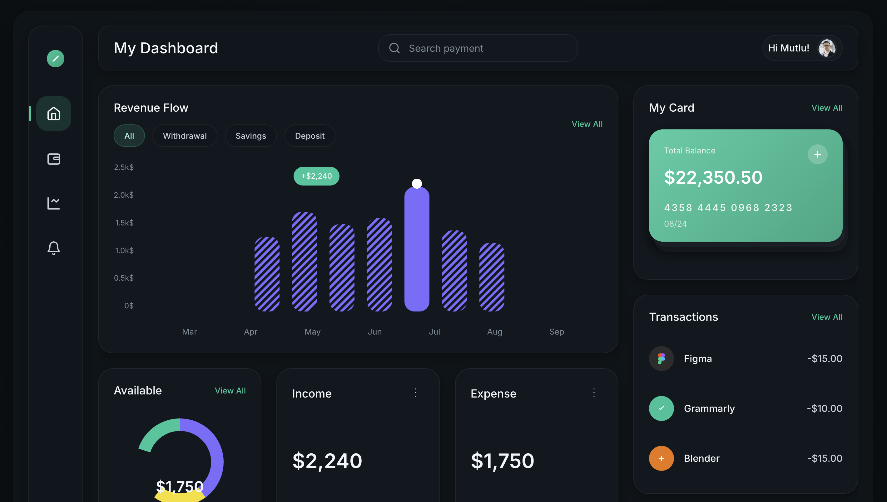
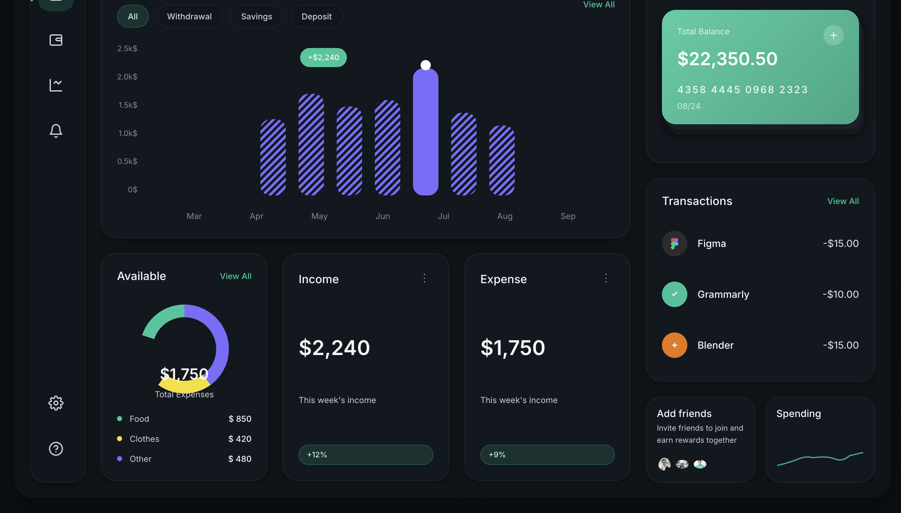

# 🌟 LuminPay - Dark Finance Dashboard

A pixel-perfect, modern finance dashboard built with pure HTML, CSS, and JavaScript. Features a sophisticated dark theme with glassmorphism effects, interactive charts, and a responsive layout.

**[🌐 Live Demo](https://mutlukurt.github.io/LuminPay/)**




## ✨ Features

### 🎨 **Modern Design System**
- **Dark Theme**: Carefully crafted color palette with proper contrast ratios
- **Glassmorphism**: Subtle transparency effects and backdrop blur
- **Responsive Layout**: Adapts seamlessly from desktop to mobile
- **Micro-interactions**: Smooth hover states and focus management

### 📊 **Interactive Components**
- **Revenue Flow Chart**: 7-column bar chart with diagonal stripe patterns
- **Donut Chart**: Multi-segment expense breakdown with center display
- **Transaction List**: Real-time transaction feed with brand icons
- **Card Stack**: 3D layered credit card display with balance overview

### 🛠 **Technical Excellence**
- **Pure Vanilla JS**: No frameworks or external dependencies
- **Modular CSS**: Clean architecture with design tokens
- **Inline SVG**: All icons and charts are scalable vector graphics
- **Accessibility**: WCAG compliant with proper ARIA labels

## 🚀 Quick Start

```bash
# Clone the repository
git clone https://github.com/yourusername/luminpay-dashboard.git

# Navigate to project directory
cd luminpay-dashboard

# Open in your browser
open index.html
```

Or use a local server:
```bash
# Using Python
python -m http.server 8000

# Using Node.js
npx serve .

# Using PHP
php -S localhost:8000
```

## 📁 Project Structure

```
luminpay-dashboard/
├── index.html              # Main HTML file
├── css/
│   ├── variables.css       # Design tokens and CSS custom properties
│   ├── base.css           # Reset, typography, and layout primitives
│   ├── components.css     # Reusable UI components
│   └── dashboard.css      # Page-specific styles and grid layout
├── js/
│   └── main.js            # Interactive functionality
└── README.md              # Project documentation
```

## 🎯 Key Components

### Sidebar Navigation
- **Width**: 88px fixed
- **Icons**: Home, Wallet, Analytics, Notifications, Settings, Help
- **Active State**: Teal highlight with left border indicator

### Revenue Flow Chart
- **7 Bars**: Monthly data from Mar to Sep
- **Patterns**: Diagonal stripe fill with highlighted current month
- **Interactive**: Hover states and value display
- **Y-Axis**: Labeled increments from 0 to 2.5k

### My Card Section
- **Stacked Design**: 3-layer perspective effect
- **Gradient**: Teal to dark teal background
- **Balance Display**: Large typography with card details
- **Add Button**: Circular plus icon in top-right

### Transactions List
- **Brand Icons**: Figma, Grammarly, Blender with proper colors
- **Typography**: Clean layout with right-aligned amounts
- **Hover Effects**: Subtle background changes

## 🎨 Design Tokens

```css
:root {
  /* Background Colors */
  --bg-900: #0B0F12;        /* Page background */
  --bg-800: #0E1418;        /* Shell container */
  --panel-700: #11181F;     /* Main panels */
  --panel-650: #0F161C;     /* Sidebar/topbar */
  
  /* Text Colors */
  --text-100: #F2F6F9;      /* Primary text */
  --text-300: #C7D0D8;      /* Muted text */
  --muted-500: #7C8A96;     /* Placeholders */
  
  /* Accent Colors */
  --accent: #16C79A;        /* Primary emerald */
  --purple: #7C6CFF;        /* Chart alternative */
  
  /* Spacing & Layout */
  --radius-lg: 24px;
  --radius-md: 18px;
  --shadow-1: 0 6px 20px rgba(0,0,0,.30);
}
```

## 📱 Responsive Breakpoints

- **Desktop**: 1200px+ (Full layout)
- **Tablet**: 1024px - 1199px (Stacked right column)
- **Mobile**: 768px and below (Single column, hidden sidebar)

## 🔧 Browser Support

- ✅ Chrome 90+
- ✅ Firefox 88+
- ✅ Safari 14+
- ✅ Edge 90+

## 🤝 Contributing

1. Fork the repository
2. Create your feature branch (`git checkout -b feature/AmazingFeature`)
3. Commit your changes (`git commit -m 'Add some AmazingFeature'`)
4. Push to the branch (`git push origin feature/AmazingFeature`)
5. Open a Pull Request

## 📄 License

This project is licensed under the MIT License - see the [LICENSE](LICENSE) file for details.

## 🙏 Acknowledgments

- **Inter Font**: Google Fonts
- **Color Palette**: Carefully selected for accessibility
- **Icons**: Custom SVG designs
- **Inspiration**: Modern fintech applications

## 📞 Contact

**Your Name** - [@yourusername](https://twitter.com/yourusername) - email@example.com

Project Link: [https://github.com/yourusername/luminpay-dashboard](https://github.com/yourusername/luminpay-dashboard)

---

⭐ **Star this repository if you found it helpful!**